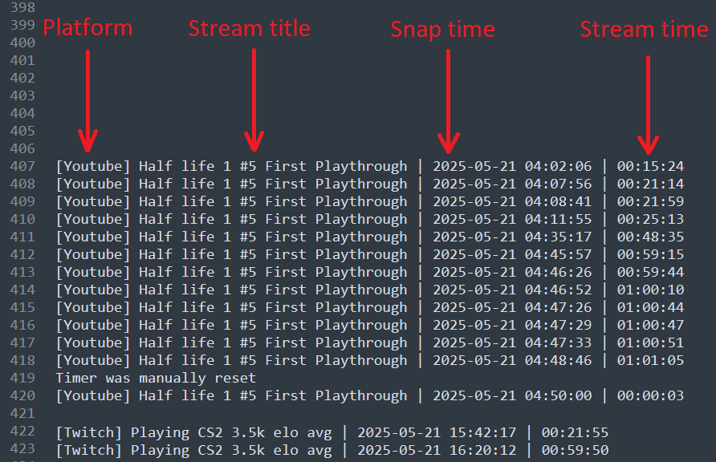
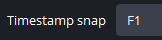
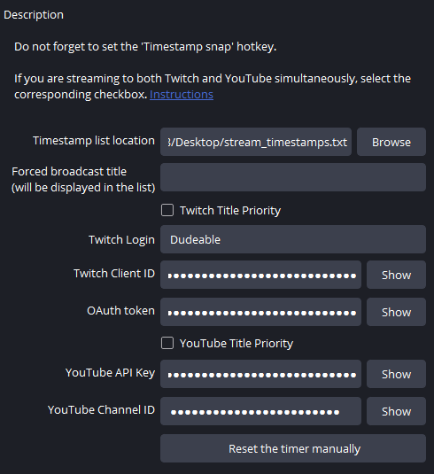
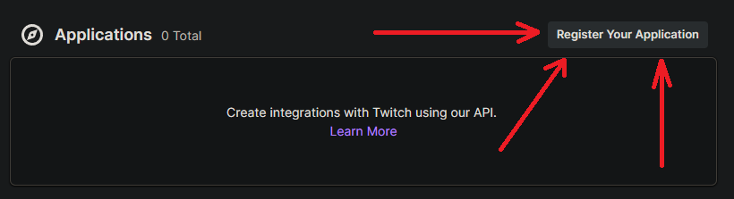
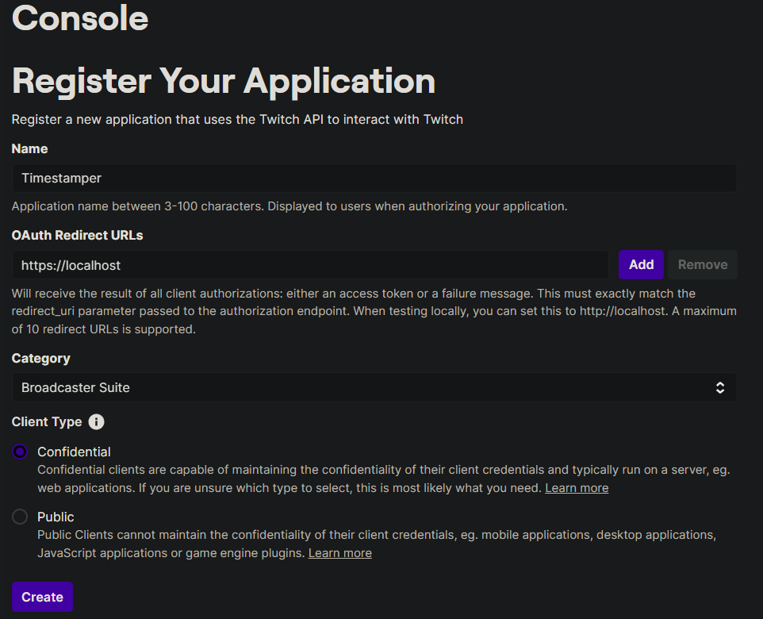
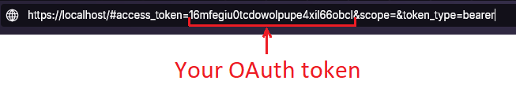
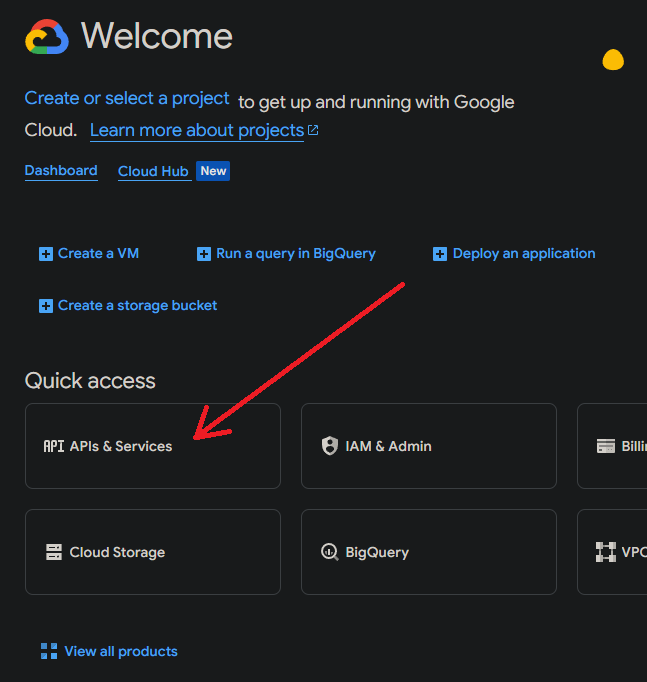
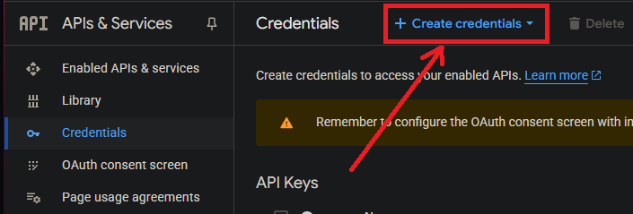

# OBS-Timestamper

**OBS-Timestamper** — this is a script for [OBS Studio](https://obsproject.com/) that allows you to record timestamps to a file during a live stream. The script was developed for personal use, as one of my methods for learning English is through video games. This tool is extremely helpful for that: I mark timestamps, rewatch the stream, and use those marks to review moments I didn’t understand — such as words or sentence structures. 

Other streamers might use it, for example, to review highlights in CS: like when you got killed even though you were already behind a wall, or to rewatch how you pulled off an ace.

---

## 🔧 Features

- Save timestamps to a file during the livestream
- Retrieve the stream title from **Twitch** or **YouTube** via API.


- Support for a hotkey to instantly add a timestamp.


- Option to manually set a custom title.


---

## 📦 Install

1. Download `timestamp.py`.
2. In OBS Studio open **Tools → Scripts**.
3. Click ```+```, add file `timestamp.py`.

---

## ⚙️ Setup

### 🟣 Twitch 🟣 
To retrieve the stream title from Twitch, you need to have [2FA](https://www.twitch.tv/settings/security) enabled!

1. Go to the [Twitch Developer site](https://dev.twitch.tv/login) and log in with the account that will be used for the stream.
2. Click ```Register Your Application```.



3. Fill in the information as shown in the image below. Click ```Create```.



4. New parameter has appeared at the bottom — **Client ID**, you’ll need to paste it in the script settings later.

5. Copy the following link: 
    ```bash
    https://id.twitch.tv/oauth2/authorize?response_type=token&client_id=YOUR_CLIENT_ID&redirect_uri=https://localhost
    ```
    Replace `YOUR_CLIENT_ID` with your actual **Client ID** from the previous step.

6. After you open the link, you will be redirected to another URL.  
From this new URL, copy the characters as shown in the image below — this is your **OAuth token**, which you will also need to paste into the script settings.



Now you can use the script with Twitch.

### 🔴 YouTube 🔴
1. Go to [Google Cloud Console](https://console.cloud.google.com/).
2. Click ```APIs & Services```.


3. Select **Library**, type ```youtube v3``` in the search bar, then click ```Enable```.

4. Go to the **Credentials** tab on the left.

5. Click ```Create Credentials```.



6. A window with your API key will appear. You will need to paste it into the script settings.
7. Go to [YouTube Account Settings](https://www.youtube.com/account_advanced).
8. Copy **Channel ID**, you'll need to paste into the script settings.


### Note
- **The maximum number of YouTube requests per day is about 50, maybe more, so don't overdo it!**
- **For the stream title to be pulled up, you need to wait:**
    - Twitch — about 15 seconds;
    - YouTube — about a minute.

